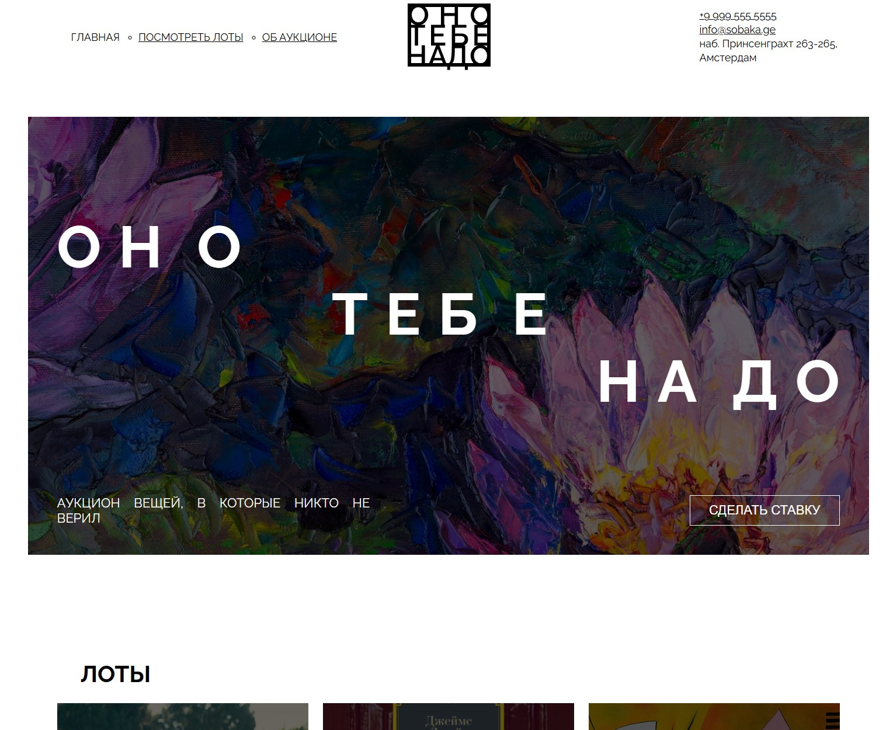

# Do_you_need_it

Статичный одностраничный сайт для аукциона необычных вещей **«Оно тебе надо»**.

Проект написан на чистом HTML и CSS. Сборка, фреймворки и зависимости не используются.



## Запуск проекта

Самый простой способ:

1. Откройте файл `index.html` в браузере.
2. Если вы работаете в VS Code, можно использовать расширение **Live Server**.

Через терминал можно открыть файл напрямую:

```bash
start index.html
```

## Структура проекта

```text
.
├── index.html          # Главная HTML-страница
├── styles/
│   ├── global.css      # Базовые стили
│   └── style.css       # Основные стили страниц
├── fonts/
│   ├── fonts.css       # Подключение локальных шрифтов
│   ├── Raleway-Regular.woff
│   ├── Raleway-Regular.woff2
│   ├── Raleway-Bold.woff
│   ├── Raleway-Bold.woff2
│   └── DSEG7Classic-Italic-Custom2.woff2
├── images/             # Изображения и иконки
└── README.md
```

## Подключение стилей

В `index.html` стили подключены в таком порядке:

```html
<link rel="stylesheet" href="./fonts/fonts.css">
<link rel="stylesheet" href="./styles/global.css">
<link rel="stylesheet" href="./styles/style.css">
```

Сначала подключается файл шрифтов, затем базовые стили, затем основные стили.

## Шрифты

В папке `fonts` находятся локальные файлы шрифтов.

Файл `fonts/fonts.css` уже подключает семейство `Raleway`:

- `Raleway-Regular.woff2` и `Raleway-Regular.woff` — обычный начертание;
- `Raleway-Bold.woff2` и `Raleway-Bold.woff` — жирное начертание.

В основных стилях шрифт используется здесь:

```css
body {
    font-family: 'Raleway', sans-serif;
}
```

Файл `DSEG7Classic-Italic-Custom2.woff2` сейчас не используется. Его можно подключить через отдельное `@font-face`, если в проекте нужен цифровой или дисплейный шрифт.

## Изображения

Все изображения находятся в папке `images`.

Используются:

- логотипы `logo-black.svg` и `logo-white.svg`;
- обложка `cover.jpg`;
- карточки лотов `card-lot-01.jpg`, `card-lot-02.jpg`, `card-lot-03.jpg`;
- иконки соцсетей `yt.svg`, `vk.svg`, `pinterest.svg`.

## Примечания

Проект рассчитан на минимальную ширину `1100px`. На мобильных устройствах может появляться горизонтальная прокрутка.

Если нужно улучшить адаптивность, следующим шагом стоит добавить media queries и уменьшить размеры блоков на маленьких экранах.
